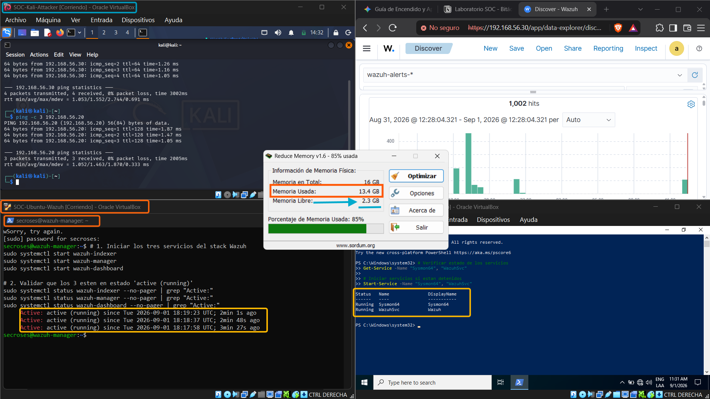

# 🛡️ Laboratorio SOC (Recursos Limitados, Air-Gapped)


> ⚠️ **Laboratorio educativo y de portafolio.** No está diseñado ni destinado para uso en producción. Todo el tráfico y las técnicas se ejecutan en una red aislada (air-gapped) sin salida a Internet ni a sistemas reales.

Laboratorio práctico de SOC para aprender ingeniería de detección y respuesta en un entorno aislado de VirtualBox, usando:
- **Wazuh** (manager + indexer)
- **Telemetría de endpoint Windows** (Sysmon + auditoría de PowerShell/Event Log)
- **Reglas de correlación personalizadas mapeadas a ATT&CK**
- **Respuesta activa (Active Response)** para contención de fuerza bruta RDP

## Propósito Educativo
Este repositorio está diseñado para aprendizaje de portafolio/laboratorio, no para despliegue en producción. Se enfoca en:
- emulación de adversarios en una red controlada
- endurecimiento de telemetría y visibilidad de logs
- desarrollo determinista de reglas personalizadas en Wazuh
- validación de detección + respuesta con evidencia reproducible

## Arquitectura del Laboratorio
- **Atacante:** Kali Linux (`192.168.56.10`)
- **Víctima:** Windows 10 Pro (`192.168.56.20`) con Agente Wazuh + Sysmon
- **Servidor SIEM/EDR:** Ubuntu Server 22.04 (`192.168.56.30`) con Wazuh AIO
- **Red:** VirtualBox host-only `192.168.56.0/24`, DHCP deshabilitado, air-gapped

Diagrama de arquitectura:



## Alcance de Recursos y Seguridad
- Línea base del host documentada: **Windows 11 con 16 GB de RAM**.
- Asignación de VMs documentada: **~6 GB en total entre 3 VMs** (Kali 1 GB, Windows 2 GB, Ubuntu 3 GB).
- Línea base JVM del indexer de Wazuh en este repo: `-Xms512m`, `-Xmx512m` (`configs/wazuh-indexer/jvm.options`).
- Pensado **únicamente para emulación de adversarios aislada, fuera de producción**.

> **Nota sobre Active Response:** actualmente solo está vinculada a la regla `100010` (fuerza bruta RDP), que bloquea dinámicamente la IP del atacante vía `netsh.exe` con un timeout de 60s. Las demás técnicas documentadas (T1059.001, T1105, T1053.005, T1070.001, T1003.001, T1197) generan alertas en el SIEM pero **todavía no disparan contención automática** — está listado como trabajo futuro.

## Prerrequisitos
- VirtualBox (o virtualización aislada equivalente)
- Guest Ubuntu Server 22.04 (servidor Wazuh)
- Guest Windows 10 Pro (objetivo del agente Wazuh)
- Guest Kali Linux (simulación del atacante)
- Python 3.x (para la prueba de humo local)

## Inicio Rápido (Secuencia de Despliegue + Validación)
1. **Clonar el repositorio**
   ```bash
   git clone https://github.com/secroses/soc-detection-lab.git
   cd soc-detection-lab
   ```
2. **Construir la topología aislada del laboratorio** usando el plan de IPs documentado arriba.
3. **Aplicar el endurecimiento de telemetría en el endpoint Windows** (como Administrador):
   ```powershell
   .\telemetry\gpo-audit-setup.ps1
   ```
4. **Cargar el contenido personalizado de Wazuh** desde:
   - `detection/rules/local_rules.xml`
   - `detection/decoders/custom_decoders.xml`
   - `configs/wazuh-manager/active_response.xml`
   - `configs/wazuh-manager/internal_options.conf`
5. **Ejecutar la prueba de humo del repositorio** antes/después de cambios:
   ```bash
   python3 scripts/smoke_test.py
   ```

## Estructura del Repositorio
```text
attacks/                      # Reportes de emulación y detección por técnica
configs/
  wazuh-indexer/jvm.options   # Perfil de memoria del indexer
  wazuh-manager/              # Active response + tuning del manager
detection/
  decoders/custom_decoders.xml
  rules/local_rules.xml
reports/
  IR-2026-10-001.md           # Ticket de incidente Tier 2 (abuso LOLBin T1105 + T1197)
scripts/smoke_test.py         # Validación de sintaxis XML + presencia de archivos críticos
telemetry/gpo-audit-setup.ps1 # Habilitación de auditoría Windows/telemetría PowerShell
docs/images/                  # Capturas de evidencia e imagen de arquitectura
```

## Cobertura de Detección MITRE ATT&CK
| Técnica | Escenario | Regla(s) Wazuh | Estado | Evidencia |
|---|---|---|---|---|
| T1110.001 | Fuerza bruta RDP | `100010`, `100011` | Validado | [`attacks/t1110-rdp-bruteforce/detection_report.md`](attacks/t1110-rdp-bruteforce/detection_report.md), [`docs/images/wazuh-alert-t1110-rdp.png`](docs/images/wazuh-alert-t1110-rdp.png) |
| T1059.001 | Comando PowerShell codificado | `100020`, `100021` | Validado | [`attacks/t1059-powershell-encoded/detection_report.md`](attacks/t1059-powershell-encoded/detection_report.md), [`docs/images/wazuh-alert-t1059-powershell.png`](docs/images/wazuh-alert-t1059-powershell.png) |
| T1105 | Transferencia de herramientas (`certutil`) | `100050` | Validado | [`attacks/t1105-ingress-tool-transfer/detection_report.md`](attacks/t1105-ingress-tool-transfer/detection_report.md), [`docs/images/wazuh-detection-t1105.png`](docs/images/wazuh-detection-t1105.png), [`reports/IR-2026-10-001.md`](reports/IR-2026-10-001.md) |
| T1053.005 | Persistencia vía tarea programada | `100030` | Validado (evidencia de imagen) | [`docs/images/01-schtasks-persistence-creation.png`](docs/images/01-schtasks-persistence-creation.png), [`docs/images/03-wazuh-siem-alert-t1053.png`](docs/images/03-wazuh-siem-alert-t1053.png) |
| T1070.001 | Borrado del log de seguridad | `100040` | Validado (evidencia de imagen) | [`docs/images/03-wazuh-siem-alert-t1070.png`](docs/images/03-wazuh-siem-alert-t1070.png) |
| T1003.001 | Volcado de memoria LSASS (`comsvcs MiniDump`) | `100060` | Validado (evidencia de imagen) | [`docs/images/01-lsass-dump-artifact-temp.png`](docs/images/01-lsass-dump-artifact-temp.png), [`docs/images/02-wazuh-siem-alert-t1003.png`](docs/images/02-wazuh-siem-alert-t1003.png) |
| T1197 | Abuso de BITS Jobs (`bitsadmin`) | `100070` | Validado (3 detecciones repetidas) | [`docs/images/01-bits-attacker-http-server.png`](docs/images/01-bits-attacker-http-server.png), [`docs/images/02-bitsadmin-transfer-execution.png`](docs/images/02-bitsadmin-transfer-execution.png), [`docs/images/03-wazuh-siem-hunting-t1197.png`](docs/images/03-wazuh-siem-hunting-t1197.png), [`reports/IR-2026-10-001.md`](reports/IR-2026-10-001.md) |

## Evidencia Destacada
- Arquitectura: [`docs/images/lab-operational-overview.png`](docs/images/lab-operational-overview.png)
- Comportamiento de active response: [`docs/images/active-response.png`](docs/images/active-response.png)
- Captura de telemetría PowerShell: [`docs/images/sysmon-telemetry-whoami.png`](docs/images/sysmon-telemetry-whoami.png)
- Cadena de transferencia de herramientas: [`docs/images/certutil-execution-cmd.png`](docs/images/certutil-execution-cmd.png), [`docs/images/payload-artifact-temp.png`](docs/images/payload-artifact-temp.png)
- Ticket de incidente Tier 2 (T1105 + T1197): [`reports/IR-2026-10-001.md`](reports/IR-2026-10-001.md)

## Validación / Prueba de Humo
Ejecutar:
```bash
python3 scripts/smoke_test.py
```
Qué verifica:
- presencia de archivos críticos del repositorio
- sintaxis XML de los archivos personalizados de decoders/reglas/manager

## Notas Operativas y Solución de Problemas
- Si la prueba de humo reporta archivos faltantes, verifica las rutas relativas desde la raíz del repositorio.
- Si el parseo de XML falla, corrige la sintaxis antes de cargarlo en el manager de Wazuh.
- Para la detección de PowerShell (`100020`, `100021`), asegúrate de haber aplicado `telemetry/gpo-audit-setup.ps1` y que los logs se estén ingiriendo.
- El timeout de active response actualmente es de `60` segundos en `configs/wazuh-manager/active_response.xml` (línea base segura para laboratorio).

## Aviso de Seguridad
Este proyecto incluye comandos de emulación de adversarios y ajustes de respuesta defensiva. Ejecútalo únicamente en entornos aislados que te pertenezcan o para los que tengas autorización explícita de pruebas.

## Licencia
MIT License
